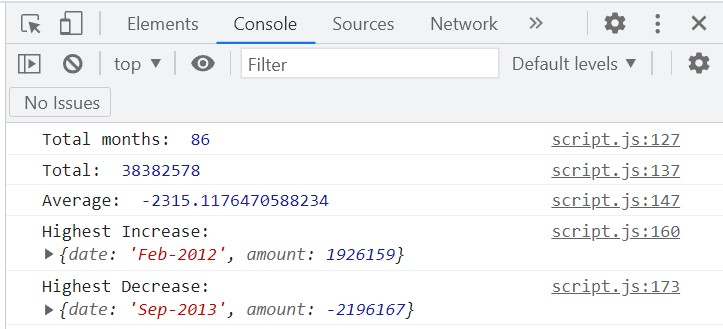

# Console-Finances

Code for analysing the financial records of a company.

## Overview

This challenge is using my newfound skills of JavaScript to creating a code for analyzing the financial records of a company.

## Instructions

I have been given a dataset composed of arrays with two fields, Date and Profit/Losses.

My task is to write a JavaScript code that analyzes the records to calculate each of the following:

    The total number of months included in the dataset.

    The net total amount of Profit/Losses over the entire period.

    The average of the changes in Profit/Losses over the entire period.
        I will need to track what the total change in profits are from month to month and then find the average.
        (Total/Number of months)

    The greatest increase in profits (date and amount) over the entire period.

    The greatest decrease in losses (date and amount) over the entire period.

When I open the code in the browser the resulting analysis should look similar to the following:

The final code should print the analysis to the console.

The URL of the deployed application: https://mewmew88.github.io/Console-Finances/

## License

MIT Licence.